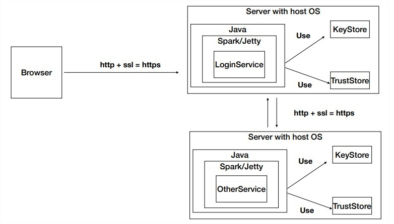

## APLICACIÓN DISTRIBUIDA SEGURA EN TODOS SUS FRENTES
### Miguel Ángel Rodríguez Siachoque
### 10 de Octubre de 2021

### Descripción
El taller consiste en crear una aplicación web pequeña usando el micro-framework de Spark java (http://sparkjava.com/). Una vez tengamos esta aplicación procederemos a construir un container para docker para la aplicación y los desplegaremos y configuraremos en nuestra máquina local. Luego, cerremos un repositorio en DockerHub y subiremos la imagen al repositorio. Finalmente, crearemos una máquina virtual de en AWS, instalaremos Docker , y desplegaremos el contenedor que acabamos de crear. 
 
Posteriormente se generara una logeo por parte del usuario con el fin de autenticar las credeciales otrogadas por el usuario, con lo cual se dara acceso al contenido establecido para este. Se genera un servicio de seguridad que terminara siendo un email y una contraseña valida para este.

### Descripción de la aplicación
 

### Requisitos :
> - Java 1.8
> - Maven 
> - Spark
> - Dockers
> - AWS
> - KeyStore
> - TrustStore

#### Packages:
 
La arquitectura de este taller se divide en 5 partes fundamentales, para generar un proceso optimo con la interacción de servidor-usario y usario-servidor.
#### Package: DiagramaPrincipal - App.java
 
Este es la parte principal, ya que se conectara de manera adecuada con la base de datos y la interacción de los archivos que contienen la información suministrada, también se puede observar la ejecución del servidor SparkWeb con el cual se mantienen los datos en funcionamiento.
#### Package: Diagrama Data Base - ReaderURL.java
 
Esta parte se encargara de generar la conexión del servidor, ya que se encargada de la lectura de la URL y la lectura de las llaves, credenciales y demás, ya creadas que posteriormente serán explicadas. Esto debido al uso de estas para el funcionamiento del aplicativo web.
#### Package: Diagrama Json - Login.java
 
Esta parte se encargara de autenticar el usuario, en esta parte del programa se establece la extración de datos utilizados por el usuario, posteriormente se generara un autenticación en caso de ser correcta se dara acceso al contenido del logueo, en otro caso se bloqueara el acceso a dicho contenido.
#### Package: Diagrama Json - Service.java
 
Esta parte se encargara de generar de la navegación del sitio web donde la parte principal sera por defecto el ___Hello World!___, pero también en otro caso se establecera la sección de logueo, por esto la parte del servicio administra esta redirección.
#### Package: Diagrama Json - User.java
 
Esta parte se encargara de generar los archivos para que los datos proporcionados por los usuarios se originen, de manera ordena con su respectiva identificación, email y contraseña. Esto complementa la documentación e iteración del los datos proporcionados.

### Creación de llaves:
> keytool -genkeypair -alias ecikeypair -keyalg RSA -keysize 2048 -storetype PKCS12 -keystore ecikeystore.p12 -validity 3650
### Exportación de llaves:
> keytool -export -keystore ./ecikeystore.p12 -alias ecikeypair -file ecicert.cer
### Importación de certificado:
> keytool -import -file ./ecicert.cer -alias firstCA keystore myTrustStore

## JavaDoc:
[JavaDoc - Security & AWS](JavaDocs/index.html)